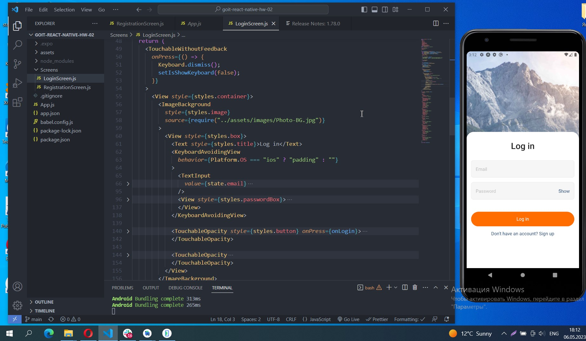
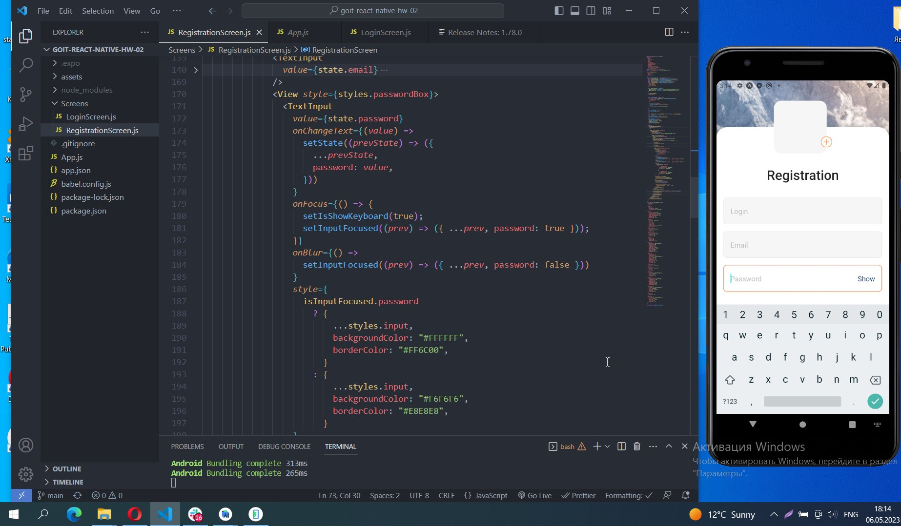
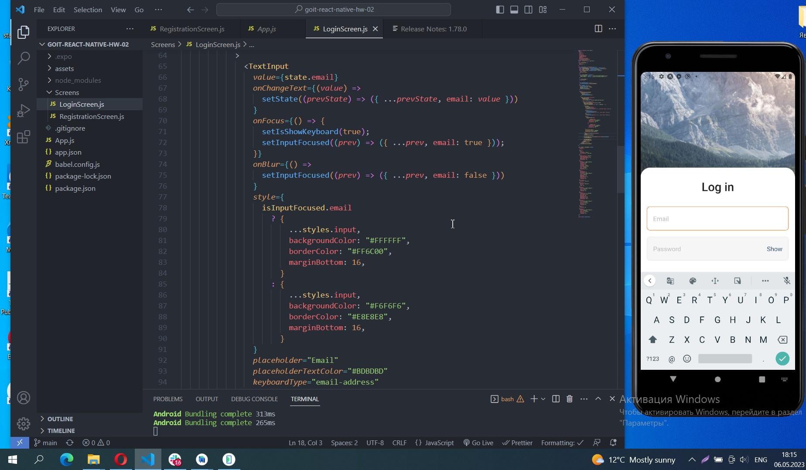
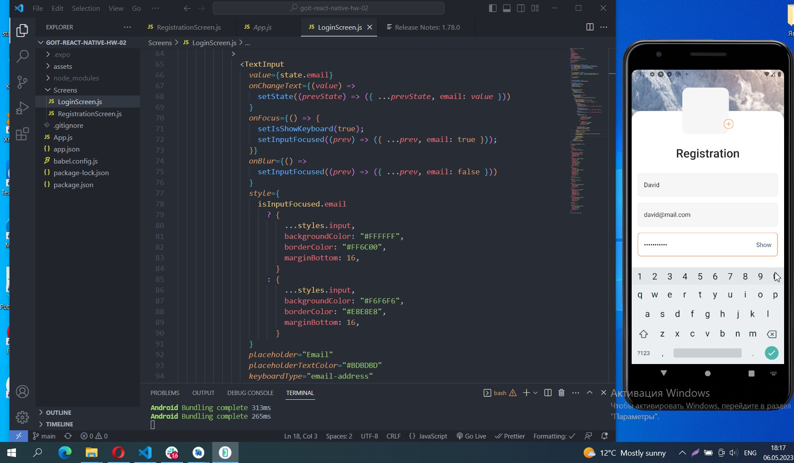
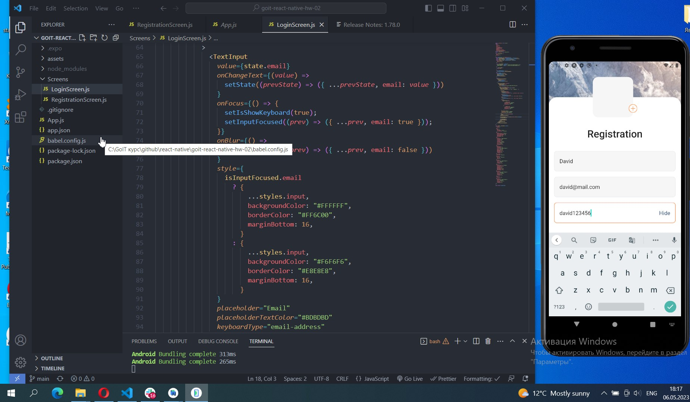
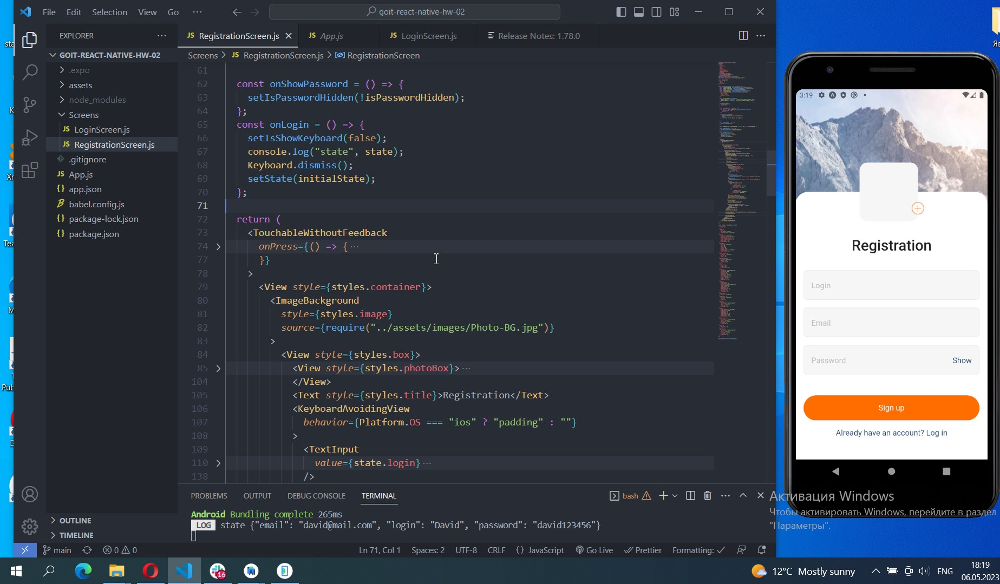
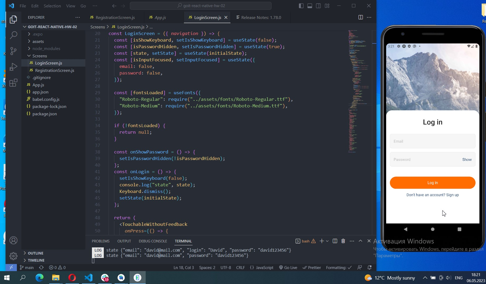

# Screenshots of project on Android emulator

## 1. App.js and Registration Screen

## 2. Login Screen

## 3. Input focused on Registration Screen

## 4. Input focused on Login Screen

## 5. Hidden password

## 6. Show password

## 7. Console log userdata from Registration Screen

## 8. Input userdata in LoginScreen

## 9. Console log userdata from Login Screen

